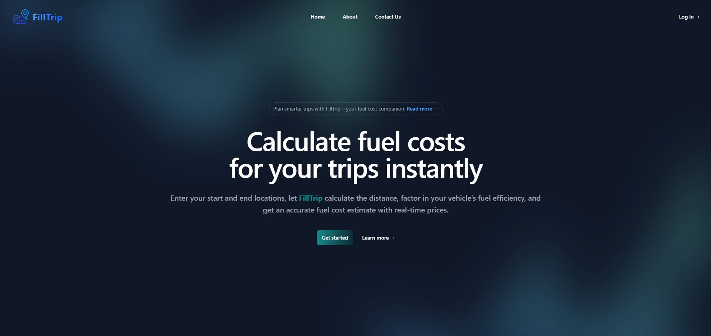
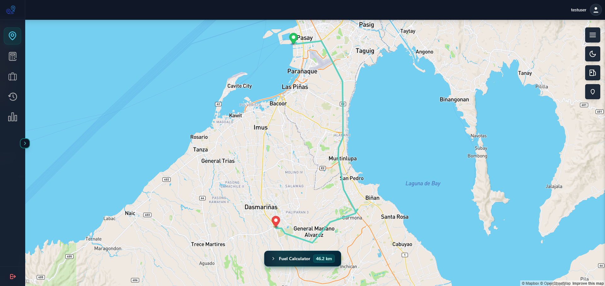
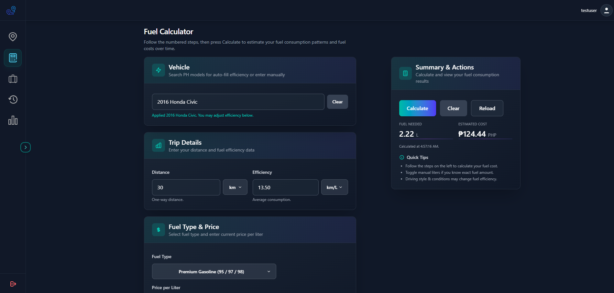
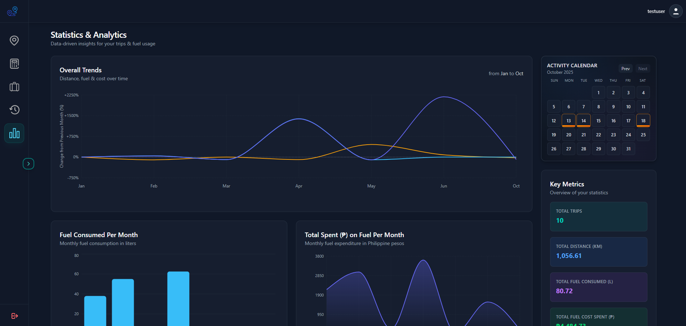
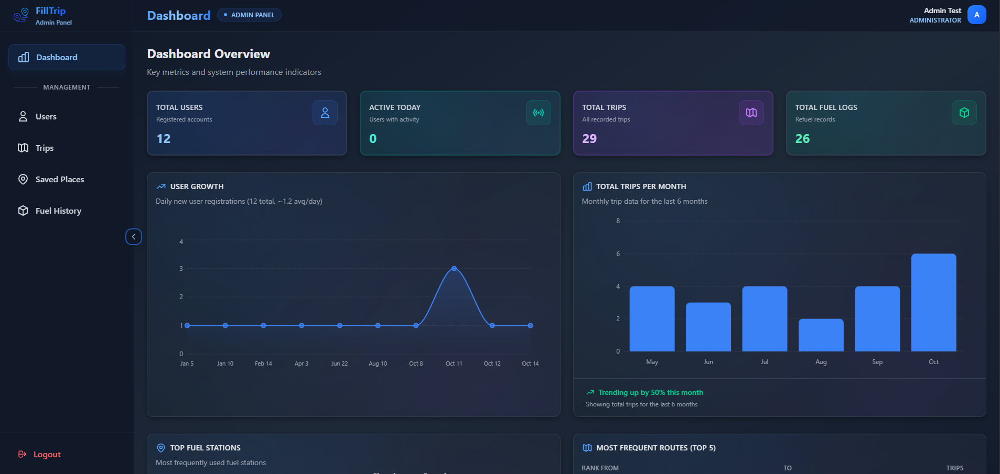

# 🚗 FillTrip: A Fuel Cost Calculator and Fuel Management System

FillTrip is a web application designed to help users plan trips, find routes, and calculate travel distances with ease.  
It also supports signup and login functionality for personalized user sessions.  

## 💻 User Preview
   
   
   
   
  

## ⚙️ Admin Preview

   

📁 Built using React, Vite, TailwindCSS   
🗓️ Completed: June 2025

# 🚗 FillTrip: Fuel Cost Calculator & Fuel Management System

FillTrip is a web application designed to help users plan trips, find optimal routes, and calculate travel distances and fuel costs.  
It features user authentication for personalized sessions and an admin dashboard for management.

## 💻 User Preview

  
  
  
  
  

## ⚙️ Admin Preview

  

## 🛠️ Built Using

- **Frontend:** React, Vite, TailwindCSS, JavaScript
- **Backend:** PHP
- **APIs:**
  - [Mapbox](https://www.mapbox.com/) (maps, routing, geolocation)
  - [Nominatim](https://nominatim.org/) (geocoding)
  - [OpenDataSoft](https://www.opendatasoft.com/) (open datasets)
  - [Overpass](https://overpass-api.de/) (OpenStreetMap querying)
- **Database:** MySQL (via XAMPP)

🗓️ **Completed:** June 2025